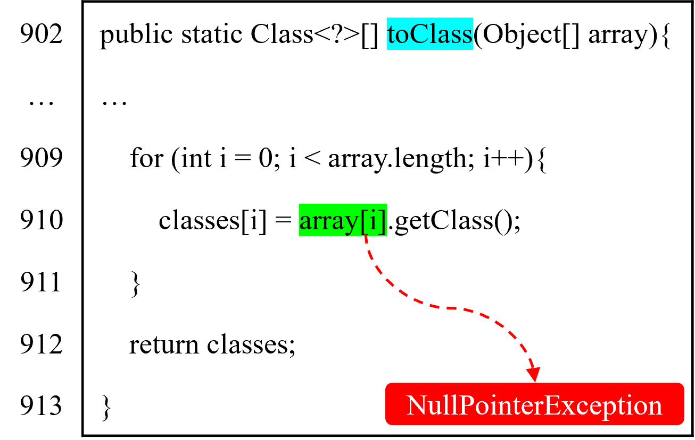

# JDExtractor

This repository hosts JDExtractor, a tool designed for automatically extracting defect-related methods and null propagation paths from Java programs.

JDExtractor automatically extract null propagation paths from sources to sink. Sources are the methods that introduce the defect, while sink is the method where an exception is triggered.

JDExtractor relies on WALA which currently supports the analysis of programs compiled with up to Java 8. JDExtractor requires Java Runtime Environment version 11. Please download open-jdk 8 and place it in the "/usr/lib/jvm/java-8-openjdk-amd64".

Contributions to this repository are highly encouraged and welcomed!

## Table of Contents
1. [Using the Tool](#Using-the-Tool)
2. [Inspecting the Output](#inspecting-the-output)
3. [Evaluation Benchmarks](#Evaluation-Benchmarks)


## Using the Tool
Here, we use Lang:33 in Defects4J as an example to intruduce the usage of JDExtractor. Please ensure that you have already added Defect4J's executables to your PATH.
1. Clone JDExtractor.
```
git clone https://github.com/ISSTAPaperTools/JDExtractor.git
```
2. Checkout a buggy source code version (commons lang, bug 33, buggy version).

```
defects4j checkout -p Lang -v 33b -w ./lang-33
```
3. Change to the lang-33, compile sources and test, and run tests.
```
cd lang-33
defects4j compile
defects4j test
```
4. Get the detailed information of stack trace.
```
cd lang-33
cat failing_tests
```


The stack trace is displayed as follows:
```
--- org.apache.commons.lang3.ClassUtilsTest::testToClass_object
java.lang.NullPointerException
	at org.apache.commons.lang3.ClassUtils.toClass(ClassUtils.java:910)
	at org.apache.commons.lang3.ClassUtilsTest.testToClass_object(ClassUtilsTest.java:910)
```
<div align="center">  </div>

5. Generate the input file "config.properties" for JDExtractor based on stack trace:

JDExtractor requires "config.properties" containing the follows content:

| Item        | Description                                                                                     |
|-------------|-------------------------------------------------------------------------------------------------|
| outputPath                   | the output file path where the result will be stored                           |
| analysisPath                 | the analyzed project path                                                      |
| exclusionsPath               | where the classes need to be excluded from the process of analysis             |
| defectFile                   | the file path that contains sink/defect method                                 |
| defectMethod                 | the sink/defect method name                                                    |
| keyVariable                  | the variable name that triggers the exception                                  |
| startLine                    | the start line of sink/defect method                                           |
| endLine                      | the end line of sink/defect method                                             |
| interestingLine              | the trigger location line                                                      |


The context of "config.properties" for Lang:33 is as follows:
```
outputPath=lang-33.json
analysisPath=./lang-33
exclusionsPath=./Java60RegressionExclusions.txt
defectFile=./lang-33/src/main/java/org/apache/commons/lang3/ClassUtils.java
defectMethod=toClass
keyVariable=array[]
startLine=902
endLine=913

interestingLine=910
```
In Lang:33, the sink name (defectMethod) is toClass, and its range is [startLine, endLine]. interestingLine=910 refers to the trigger location.

6. Run JDExtractor:

```
java -jar JDExtractor.jar config.properties
```

## Inspecting the Output

You can view the output of JDExtractor in lang-33.json:

```json
{
    "type set": [
        "Ljava/lang/Object",
        "Ljava/io/Serializable",
        "Ljava/lang/Cloneable",
        "[Ljava/lang/Object"
    ],
    "sink": "org.apache.commons.lang3.ClassUtils.toClass([Ljava/lang/Object;)[Ljava/lang/Class;",
    "key variable type": "<Application,[Ljava/lang/Object>",
    "result node": [
        "Node: < Application, Lorg/apache/commons/lang3/ClassUtils, toClass([Ljava/lang/Object;)[Ljava/lang/Class; > Context: Everywhere",
        "Node: < Application, Lorg/apache/commons/lang3/ClassUtilsTest, testToClass_object()V > Context: Everywhere"
    ],
    "have_result": "have result",
    "source fields": [],
    "# edge of datagraph": 1068,
    " # node of datagraph": 793,
    "# of result node": 2,
    "defect-related methods": [
        "Node: < Application, Lorg/apache/commons/lang3/ClassUtils, toClass([Ljava/lang/Object;)[Ljava/lang/Class; > Context: Everywhere",
        "Node: < Application, Lorg/apache/commons/lang3/ClassUtilsTest, testToClass_object()V > Context: Everywhere"
    ],
    "result": {"paths": {"org.apache.commons.lang3.ClassUtilsTest.testToClass_object()V": {
        "path Num for one source": 1,
        "paths size": 1,
        "path0": {
            "path": ["org.apache.commons.lang3.ClassUtilsTest.testToClass_object()V---call---org.apache.commons.lang3.ClassUtils.toClass([Ljava/lang/Object;)[Ljava/lang/Class;"],
            "node num": 2,
            "edge num": 1
        }
    }}},
    "analysis time": 18177,
    "result paths": 1,
    "defect-related fields": [],
    " # of source methods": 2,
    "source methods": [
        "org.apache.commons.lang3.ClassUtils.toClass([Ljava/lang/Object;)[Ljava/lang/Class;",
        "org.apache.commons.lang3.ClassUtilsTest.testToClass_object()V"
    ],
    "# of source fields": 0,
    "# node of datagraph'": 4,
    "# of defect-related fields": 0,
    "# of defect-related methods": 2,
    "# edge of datagraph'": 3
}
```
## Evaluation Benchmarks
The evaluation benchmarks are shown in benchmark.xlsx. We distinguish different tests that trigger NPE and finally select 22 defects from Defects4J serve as a benchmark. Additionally, we explored other null propagation paths for these 22 defects, and each paths can trigger NPE by constructing test cases.

benchmark.xlsx includes the follows content:

| Item        | Description                                                                                     |
|-------------|-------------------------------------------------------------------------------------------------|
| ID                           | the unique identifier                                                          |
| project                      | project-id in Defects4j                                                        |
| commit url                   | commit url that fixes the defect                                               |
| trigger points               | the method which is called by key variable to trigger an exception             |
| testFile                     | test class in Defects4J                                                        |
| testMethod                   | test method in Defects4J                                                       |
| defectFile                   | the path of sink file                                                          |
| defectMethod                 | the name of sink                                                               |
| keyVarialbe                  | the name of key variable                                                       |
| startLine                    | the start line of sink                                                         |
| endLine                      | the end line of sink                                                           |
| interestingLine              | the trigger location line                                                      |
| paths                        | the null propagation paths                                                     |


